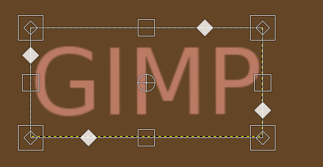

- [1. ¿Qué es GIMP?](#1-qué-es-gimp)
- [2. Instalar GIMP](#2-instalar-gimp)
- [3. Comenzar a utilizar GIMP](#3-comenzar-a-utilizar-gimp)
- [4. Trabajo con archivos](#4-trabajo-con-archivos)
  - [Formatos de imagen XCF](#formatos-de-imagen-xcf)
  - [Exportar](#exportar)
- [5. LA DISPOSICION DE LA PANTALLA](#5-la-disposicion-de-la-pantalla)
- [6. Preferencias](#6-preferencias)
- [7. Consejos adicionales](#7-consejos-adicionales)
- [Opciones de Herramientas](#opciones-de-herramientas)
- [Zoom](#zoom)
- [Mover](#mover)
- [Dibujar](#dibujar)
- [Capas](#capas)
- [Seleccionar partes de la imagen](#seleccionar-partes-de-la-imagen)
- [Escalar y transformar](#escalar-y-transformar)
- [Texto](#texto)

# 1. ¿Qué es GIMP?

**GIMP** es una aplicación adecuada para la edición y composición de imágenes así como para el retoque fotográfico. Esta herramienta es gratuita y representa una excelente opción frente a otros programas comerciales como Adobe PhotoShop.

# 2. Instalar GIMP

Para instalar GIMP en vuestro ordenador, tenéis que ir a este enlace: https://www.gimp.org/downloads/

# 3. Comenzar a utilizar GIMP

Os recomiendo comenzar a probarlo siguiendo esta pequeña guía inicial: http://formacion.intef.es/pluginfile.php/42882/mod_imscp/content/1/empezar_con_gimp.html

**La caja de herramientas**

La siguiente ventana que vamos a ver es **La Caja de Herramientas**. Es el corazón de Gimp y la ventana más importante. No se puede duplicar ni borrar (obviamente, esto cerraría Gimp). En ella se encuentran la mayoría de herramientas de Gimp 

**Cuadros de color**

Bajo las herramientas , los cuadrados negro y blanco, muestran el **color de fondo y frente** seleccionado, pinchando dos veces sobre cualquiera de ellos, se accede al diálogo para seleccionar un nuevo color, lo mismo con el otro.

**Brochas, patrones y degradados**

A la derecha de estos, **brochas, patrones y degradados seleccionados**; pinchando sobre ellos, se abre el diálogo correspondiente. Por debajo de estos, una pequeña imagen de la imagen activa. Si pinchas sobre ella se abre el diálogo de imagen con una lista de las imágenes abiertas .Si sitúas el ratón sobre los distintos iconos aparecerá información sobre ellos y, en el caso de las herramientas, también muestra un atajo de teclado. 

Desde **Archivo/Preferencias/Caja de Herramientas**se pueden habilitar o no que se muestren: Color de fondo y frente, Brochas, Patrones y Degradados, y Imagen activa.

# 4. Trabajo con archivos

Para trabajar podemos crear un archivo nuevo, o bien abrir otro archivo ya existente.

- Crear imagen Ctrl+N
- Guardar Ctrl+S
- Abrir imagen Ctrl+O

## Formatos de imagen XCF

Puedes guardar tus progresos sobre una imagen en el formato nativo de **xcf**. De este modo se guardan las capas y preferencias por separado, y siempre podremos seguir editando el archivo desde Gimp.

## Exportar

Si queremos poder compartir y ver el archivo fuera de Gimp, tenemos que exportar el archivo a un formato de imagen, como **jpg, gif o png**.

# 5. LA DISPOSICION DE LA PANTALLA

Con lo visto hasta ahora, ya podemos tener una disposición de pantalla similar a la de la captura.Ahí están abiertas: 

- A la izquierda, La Caja de Herramientas Principal, empotrada debajo está Opciones de Herramienta; 
- En el medio, La Ventana de Imagen
- A la derecha, Capas, Canales, Rutas y Deshacer, empotrada debajo está Brochas, Patrones y Degradados.

Hay muchas configuraciones posibles, esta es una. Lo mejor es, que puedes disponer de los distintos diálogos de la manera que mejor se adapte a tus necesidades. Una vez tengas la configuración que te interesa, Guárdala, más abajo se explica como.

# 6. Preferencias

Abrimos Archivo/Preferencias: Aquí tenemos diálogos para personalizar algunos de los comportamientos de Gimp.

De momento podríamos fijarnos en los siguientes diálogos: 

- Nueva imagen: Ajustar diferentes parámetros para la imagen cuando( tamaño, resolución, color, etc. ) creamos una imagen nueva (Archivo/Nuevo o Ctrl N). En Comentario podemos poner algún dato de interés: autor, programa, fecha, etc.
- Administración de la ventana: No marcar la casilla Guardar posiciones de ventanas al salir.
Pinchamos sobre Guardar posiciones de ventana ahora.

SIEMPRE puedes recuperar la configuración predeterminada pulsando sobre: Restaurar las posiciones de ventana guardadas a los valores predeterminados.

# 7. Consejos adicionales

# Opciones de Herramientas

Es un diálogo empotrable, en este caso está 	empotrada a la Caja de Herramientas, te permite configurar distintos 	parámetros de la herramienta seleccionada, en este caso el 	Pincel.

**Ventana Capas, Canales, Rutas, Deshacer.**

Un diálogo empotrable con cuatro solapas( solo podrá estar activa una solapa) : La capa, canal o ruta **activa** se muestra resaltada en azul; y será visible si se ve un icono de un ojo , pinchando sobre este icono desaparece, y la capa, canal o ruta no será visible, y viceversa. Desde los tres primeros diálogos puedes manipular diversos aspectos, como son editar, modificar y manejar:

- Capas: la capa o capas que componen la imagen.
- Canales: los canales de color de la imagen y las máscaras de selección.
- Rutas: las rutas que hayas creado. Puedes convertirlas en selecciones y viceversa.

El diálogo Deshacer te permite volver a un estado anterior o posterior de la manipulación que haces sobre una imagen.
5.Brochas, Patrones, Degradados. 

Otro diálogo empotrable con tres solapas que te permite seleccionar los distintos tipos disponibles de Brochas, Patrones y Degradados.

# Zoom

Alejarnos o acercarnos con **Ctrl + rueda** (ratón). Otros zooms rápidos son:

- 1 para tamaño real
- 2,3,4,5 para doble, triple, etc.

Otras opciones:

- Centrar imagen con shift + J

# Mover

- Mover M
- Pulsando la rueda del ratón también podemos mover

# Dibujar

Tenemos diferentes herramientas de dibujo, como por ejemplo:

- Lápiz N
- Pincel P
- Goma de borrar Shift+E

# Capas

Las capas nos permiten tener partes de la composición separadas, y solo trabajar sobre las que queremos, sin afectar a las demás.

- Para abrir el diálogo de capas: Ctrl+L
- Abrir una imagen de un archivo como capa: Ctrl+Alt+O
- Pegar como capa: Ctrl + shift + V
- Combinar capas visibles: Ctrl+M

# Seleccionar partes de la imagen

Crear selecciones nos permite decidir sobre qué parte de la imagen queremos actuar. Se pueden hacer con diferentes formas:

- Selección rectangular: R
- Seleección elipse: E

Otras herramientas nos permiten crear selecciones automáticas basadas en colores o bien manuales, para formas irregulares:

- varita mágica U

# Escalar y transformar

Utilizando Shift+T:

# Texto

- Texto T
