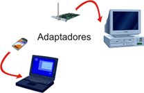
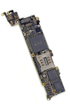
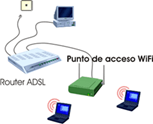
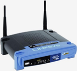
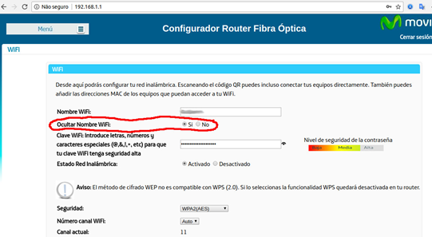
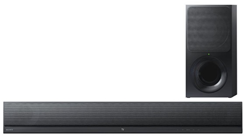

# REDES INALÁMBRICAS

- [REDES INALÁMBRICAS](#redes-inal%c3%81mbricas)
  - [1. INTRODUCCIÓN](#1-introducci%c3%93n)
  - [2. WIFI](#2-wifi)
    - [2.1	ESTÁNDARES](#21-est%c3%81ndares)
    - [2.2. DISPOSITIVOS WIFI](#22-dispositivos-wifi)
    - [2.3	EQUIPOS FINALES](#23-equipos-finales)
    - [2.4	EQUIPOS DE RED](#24-equipos-de-red)
    - [2.4.1	PUNTO DE ACCESO](#241-punto-de-acceso)
      - [2.4.2	REPETIDORES INALÁMBRICOS](#242-repetidores-inal%c3%81mbricos)
      - [2.4.3	ROUTERS INALÁMBRICOS](#243-routers-inal%c3%81mbricos)
    - [2.5	SEGURIDAD EN REDES WIFI](#25-seguridad-en-redes-wifi)
      - [2.5.1	ENCRIPTACIÓN](#251-encriptaci%c3%93n)
      - [2.5.2	REDES 5 GHZ Y 2.4 GHZ](#252-redes-5-ghz-y-24-ghz)
      - [2.5.3.	Bloquear el acceso utilizando filtrado MAC](#253-bloquear-el-acceso-utilizando-filtrado-mac)
      - [2.5.4	OCULTACIÓN DE RED](#254-ocultaci%c3%93n-de-red)
  - [3.	BLUETOOTH](#3-bluetooth)
    - [3.1	INTRODUCCIÓN](#31-introducci%c3%93n)
    - [3.2	OBJETIVOS](#32-objetivos)
    - [3.3	CONFIGURACIÓN Y CONEXIÓN DE DISPOSITIVOS](#33-configuraci%c3%93n-y-conexi%c3%93n-de-dispositivos)
    - [3.4	EJEMPLOS](#34-ejemplos)

## 1. INTRODUCCIÓN

- Las redes más sencillas y económicas son las realizadas por medio de cables.
- Si los ordenadores están próximos y permanecen siempre en el mismo sitio, esta puede ser la mejor opción.

La tecnología inalámbrica es especialmente útil si:

- Si los ordenadores están alejados
- Los cables pueden molestar
- Se quiere disfrutar de la conexión a Internet en cualquier rincón
- La instalación de una red inalámbrica presenta muchas ventajas. La principal, es que no hay cables por en medio

Las tecnologías de redes inalámbricas más extendidas son:

- Bluetooth
- Telefonía móvil (3G, 4G)
- Wifi

En general todos utilizamos una combinación de ellas, puesto que según el uso que queramos dar y dónde nos encontremos, nos serán más o menos convenientes.

## 2. WIFI

Las redes wifi tienen las siguientes ventajas, con respecto a las conexiones por cable:

- **Comodidad**: muy superior a las redes cableadas. Cualquiera que tenga acceso a la red puede conectarse desde distintos puntos dentro de un rango de espacio
- Instalación: permiten el acceso de múltiples ordenadores sin ningún problema ni gasto en infraestructura, ni gran cantidad de cables.
- **Compatibilidad**: En cualquier parte del mundo podremos utilizar la tecnología Wifi.
Por el contrario, también presentan algunos inconvenientes, como, por ejemplo:
- **Menor velocidad** en comparación a una conexión cableada, debido a interferencias y pérdidas de señal
- **Seguridad**. Existen algunos programas capaces de capturar paquetes, de forma que puedan calcular la contraseña de la red y de esta forma acceder a ella. 
- No se puede controlar el área de **cobertura** de una conexión, de manera que un receptor se puede conectar desde fuera de la zona de recepción prevista (e.g. desde fuera de una oficina, desde una vivienda colindante).
- No es **compatible** con otros tipos de conexiones sin cables como Bluetooth, GPRS, UMTS, etc.

### 2.1	ESTÁNDARES

Un estándar son una serie de normas que definen las características de una red de área local inalámbrica (WLAN).
Las redes Wifi también se agrupan en el estándar 802.11. Una red Wifi es una red que cumple con el estándar 802.11.

A los dispositivos certificados por la “WiFi Alliance” usan un logotipo como el siguiente, e indica que son compatibles con la tecnología Wifi.

Según el tipo de conexión Wifi, tenemos diferentes “estándares” o versiones, que permiten diferentes tipos de conexiones, con velocidades y distancias diferentes. Algunas de ellas son:

- 802.11b
- 802.11g
- 802.11a
- 802.11n

A medida que la investigación avanza, se crean versiones nuevas, que proporcionan más velocidad y/o cobertura, entre otras. En este recuadro podéis ver las diferencias entre algunas de las versiones:

Es importante que los equipos que se desea conectar a una red wifi entiendan el mismo “idioma” y por tanto utilicen versiones de wifi que entiendan todos.

    Actividad: adjunta una captura de las redes wifi que detectas con tu móvil

### 2.2. DISPOSITIVOS WIFI

Para poder crear una red wifi, necesitamos:

- Dispositivos (smartphones, tablets, TV, ordenadores) 
- Equipos de conexión (router, punto de acceso, etc.). 

En función de la red que queramos montar necesitemos unos u otro. También es posible conectar móviles entre ellos a través de wifi sin necesidad de un router, pero no es lo más habitual.

### 2.3	EQUIPOS FINALES

En equipos antiguos, fabricados antes de inventarse las redes inalámbricas, necesitamos adaptadores para hacer que estos equipos se puedan conectar a una red wifi. 

Existen diferentes tipos:

**Tarjetas de expansión**

Se agregan (o vienen de fábrica) a los ordenadores de sobremesa. Hoy en día están perdiendo terreno debido a las tarjetas USB. 

**Tarjetas PCMCIA**
Modelo que se utilizó mucho en los primeros ordenadores portátiles, Hoy en día internas en estos ordenadores. 

**Antenas USB**
Tipo más común que existe en las tiendas y más sencillo de conectar a un pc, ya sea de sobremesa o portátil
Haciendo uso de todas las ventajas que tiene la tecnología USB.

**Circuitos internos**

La mayoría de dispositivos hoy en día disponen de adaptadores Wi-Fi en los circuitos internos de. Los podemos encontrar en:

- Televisiones
- Móviles y tablets
- Portátiles
- Consolas

    Actividad: explica qué equipos de tu casa están conectados a través de Wifi, y cuáles de los dispositivos anteriores utiliza cada uno de ellos para poderse conectar

### 2.4	EQUIPOS DE RED

Generalmente los equipos no se conectan directamente entre ellos, sino que necesitan un equipo de red, como por ejemplo un router, para qué gestione la red, los comunique a todos entre ellos, y les de salida a internet. Para ello existen diferentes equipos:

### 2.4.1	PUNTO DE ACCESO

Cuando tenemos un edificio o casa muy grande, podemos necesitar ampliar la cobertura de nuestra red. Los **puntos de acceso** generan una Red WiFi a la que se pueden conectar otros dispositivos. 

Permiten conectar dispositivos en forma inalámbrica a una red existente. 

Pueden agregarse más puntos de acceso a una red para generar redes de cobertura más amplia. Suelen estar en las paredes de los pasillos en edificios grandes.

#### 2.4.2	REPETIDORES INALÁMBRICOS

- Se utilizan para extender la cobertura de una red inalámbrica
- Se conectan a una red existente que tiene señal más débil
- Crean una señal limpia a la que se pueden conectar los equipos dentro de su alcance. 

#### 2.4.3	ROUTERS INALÁMBRICOS

- Dispositivos compuestos, especialmente diseñados para redes pequeñas (hogar o pequeña oficina). Estos dispositivos incluyen:
–	Router encargado de interconectar redes con internet
–	Punto de acceso (explicado más arriba)
–	Switch Permite la comunicación entre todos los equipos conectados
- Las antenas nos permiten transmitir y recibir la señal de radiofrecuencia para comunicar por Wifi con los diferentes equipos. 

    Actividad: Explica qué equipos de red de los anteriores tienes en tu casa, y adjunta una foto de ellos. 

    Actividad: ¿Cuales de ellos crees que te sería más útil si vivieras en una casa de 3 pisos? ¿Por qué?

### 2.5	SEGURIDAD EN REDES WIFI

Las redes wifi, al transmitirse por el aire, son especialmente sensibles a ataques y usos indebidos. Es por ello que la seguridad es especialmente importante, por encima de las redes cableadas. Para ello podemos tomar varias medidas:

#### 2.5.1	ENCRIPTACIÓN

Los datos transmitidos por wifi se envían por el aire, por lo que cualquier persona con una antena podría capturarlos y ver lo que estamos enviando (fotos, correos, etc.). Por ello es importante cifrar la información o encriptarla, utilizando algún tipo de contraseña.

Algunos tipos de encriptación Wi-Fi son WEP y WPA, encargados de la codificación de la información transmitida para proteger su confidencialidad. Estos mecanismos transforman lo que estamos enviando para que nadie lo pueda entender salvo el ordenador al que lo enviamos. Utilizaremos para ello una contraseña, que solo sabrán los usuarios autorizados de esa red.

Entrando en el router podemos cambiar el tipo de encriptación (modo de seguridad), cambiar el nombre de nuestra red o la contraseña. Esto solo lo puede hacer el administrador de red. En general, viene ya configurado, y solo usuarios con conocimientos lo pueden cambiar.

**Información en el router**

En nuestro router, podemos ver en la parte posterior la información para conectarnos. Como podéis ver, la mayoría de routers hoy en día tienen configuradas dos redes Wi-Fi diferentes, cada una con su nombre (SSID).

También podemos ver la clave, necesaria para podernos conectar. También tenemos unos códigos QR que, en función del dispositivo, le podemos hacer una foto y se conecta a la red sin tener que buscar el nombre ni escribir la contraseña a mano.

    Actividad: adjunta una foto de la etiqueta de tu router. Tapa la clave a ser posible con paint o alguna herramienta de google docs. ¿Cuántas redes wifi tienes y cómo se llaman?¿a cual o cuales te conectas?

#### 2.5.2	REDES 5 GHZ Y 2.4 GHZ 

Muchos habréis visto que tenéis en casa o podéis tener dos redes wifi diferentes. Una funciona con ondas de 5 GHz y otra de 2.4 GHz. Son como diferentes canales de radio. En función de lo que queramos hacer, nos conviene una u otra.

- La de 5 GHz nos ofrece más velocidad, pero llega menos lejos, por lo que es conveniente si estamos cerca. Funciona muy bien para jugar online, o servicios de Streaming (Netflix, HBO)
- La de 2.4 GHz es mejor para chatear, enviar emails o navegar por la red.

#### 2.5.3.	Bloquear el acceso utilizando filtrado MAC

El **filtrado de MAC** sólo se permite acceso a los dispositivos autorizados. Como esta dirección es fija para cada tarjeta de red, tiene muchas aplicaciones. Por ejemplo, vuestro móvil tiene una tarjeta de red dentro, y por tanto una dirección MAC propia (es única y permite identificar vuestro móvil).

Como cada teléfono tiene una dirección MAC propia, podemos dejar conectar o no a Internet a los móviles que nosotros queramos. Esto se llama filtrado MAC.

En el router se crea una lista de direcciones permitidas, las de cada dispositivo que se puede conectar. Si un móvil con esta dirección se conecta al router, este le permitirá conectarse a Internet. En caso contrario, se conectará a la wifi correctamente pero no tendrá internet.

**Ejemplo**

En primer lugar, se crea una lista en el router, donde agregaremos todas las direcciones MAC que queramos restringir. Podremos elegir si lo que queremos es permitir solo esos ordenadores y no dejar conectarse a nadie más o, por el contrario, dejar conectar a todo el mundo menos a esos.

    Actividad: imagina que quieres bloquear el móvil de tus padres para que no se conecten a la wifi. Qué información necesitas saber de sus teléfonos y del router y qué pasos tienes que seguir para hacerlo?

#### 2.5.4	OCULTACIÓN DE RED

Una forma de evitar que alguien se conecte a mi red wifi es ocultarla. Esto se llama ocultación del punto de acceso (ocultación SSID). De este modo, la red no se muestra en la lista de redes wifi para conectarse y por tanto es invisible a otros usuarios.

Los que sí conocen el nombre de la red wifi la pueden **escribir a mano el nombre de la red wifi** y conectarse, por lo que necesitan saber el nombre de antemano.

También podríamos directamente desactivar la red wifi si solo conectamos al router con cables. De este modo, nadie se podrá conectar por wifi a nuestra red.

## 3.	BLUETOOTH

### 3.1	INTRODUCCIÓN

Bluetooth es una tecnología desarrollada para la comunicación inalámbrica de datos de corto alcance.

Algunas de sus características:

- Baja complejidad
- Bajo consumo
-	Bajo costo

Bluetooth, al igual que Wifi, tiene la capacidad de atravesar paredes y maletines, por lo cual es ideal tanto para el trabajo móvil, como el trabajo en oficinas.

### 3.2	OBJETIVOS

- Principales objetivos que se pretenden conseguir con esta norma son:
–	Facilitar las comunicaciones entre equipos móviles.
–	Eliminar los cables y conectores entre estos.
–	Ofrecer la posibilidad de crear pequeñas redes inalámbricas y facilitar la sincronización de datos entre equipos personales.
- Bluetooth es particularmente conveniente en ciertas situaciones, por ejemplo, 
–	Al transferir archivos de un teléfono móvil a otro sin cables. 
–	Enviar música y fotos entre una PC y un teléfono móvil es otra aplicación útil.

### 3.3	CONFIGURACIÓN Y CONEXIÓN DE DISPOSITIVOS

- Primero se debe establecer el SSID del dispositivo, ponerle un nombre.
- Para establecer comunicación entre dispositives hay que emparejarlos
- Se sigue una estructura maestro-esclavó
–	Se activan los dos dispositives
–	Maestro: debe estar visibles en un radio inferior de 10 m.
–	Esclavo: se encarga de buscar otros dispositives dentro del radio.
- Cuando se encuentra un dispositivo, se inicia un protocolo de seguridad basado en código.
- El código puede ser
–	Cuatro cifras
–	Una frase larga
- Se comprueba el código en el dispositivo maestro y en el esclavo.
- Si es el mismo, se establece el emparejamiento y comienza el traspaso de información.

Actividad: 

    Habilita bluetooth en tu móvil y adjunta una captura de las conexiones bluetooth disponibles.

### 3.4	EJEMPLOS

La mayoría de coches disponen de un sistema de navegación integrado que permite conectar con un smartphone a través de Bluetooth, para poder, entre otras funciones:

**Bluetooth en el coche**

- Hacer llamadas utilizando la función de manos libres. Podemos acceder a la agenda de contactos del móvil a través de la consola.
- Reproducir música desde el móvil.

**Auriculares inalámbricos**

Otro ejemplo lo podemos encontrar en auriculares inalámbricos, que nos permiten escuchar la música de un dispositivo cercano sin necesidad de cables. Un ejemplo es el de los Airpods de Apple.

**Teclados, ratones y mandos**

La mayoría de los teclados y ratones hoy en día son inalámbricos, pues nos permiten evitar tener cables por en medio, y poder conectar un ratón o teclado a diferentes dispositivos según lo necesitemos.

**Equipos de sonido**

Otro caso interesante es el de los sistemas de sonido home cinema, en los que tenemos varios altavoces repartidos por una habitación, y podemos utilizar la tecnología Bluetooth para conectarlos sin cables y se envíen el sonido de forma inalámbrica.

En este caso, la barra de sonido sí estaría conectada al televisor, pero el subwoofer se conectaría con la barra a través de Bluetooth.

    Actividad: de todos los ejemplos anteriores, explica cuales de ellos tenéis en casa tú o algún miembro de tu familia. ¿Qué inconvenientes crees que pueden tener?