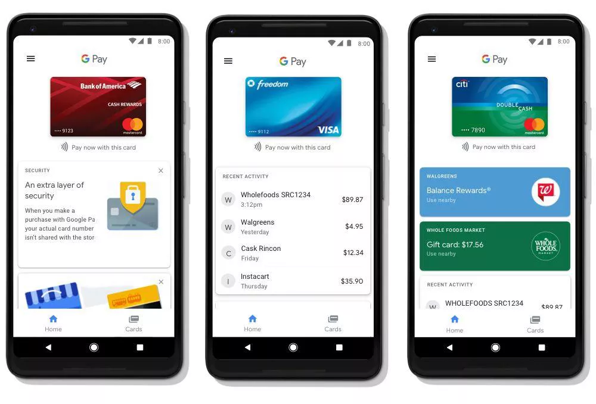

### Pago contactless

Es un sistema de pago inalámbrico utilizando la **tecnología NFC** que nos permite realizar pagos con solo aproximar el medio de pago (tar-jeta, móvil, smartwatch...) al terminal de pago (datáfono) compatible con esta tecnología.

Así podemos utilizar, como forma de pago, nuestro móvil junto con alguna de las aplicaciones   de   cartera   virtual. Para ello, tenemos a nuestra dispositición muchas **apps** diferentes:

- Google Pay
- Apple Pay
- Samsung Pay

Los bancos tienen también sus propias apps para los diferentes sistemas operativos:

- BBVA Wallet
- La-Caixa Wallet